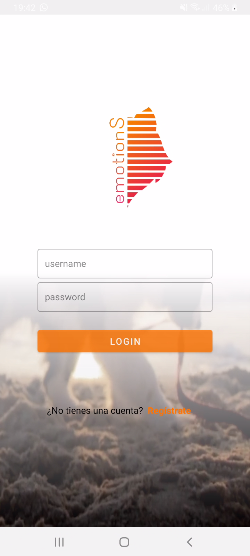
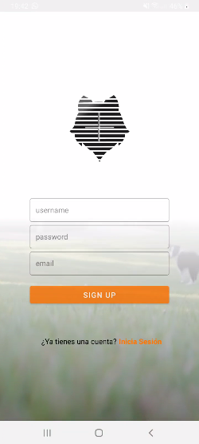
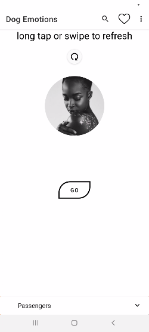

# MyNiceStar
[ssebass7](https://github.com/search?q=ssebass7)

><b><i>Linux is love</i></b> 
>En la carpeta "VIDEO" del proyecto, se encuentra un archivo multimedia donde se muestra la aplicacion. Ir a
<a href="VIDEO/video_emotions_login_registro.mp4">Video</a>

 Splash | Log In | Sign Up
-------|-------|------
 |   | 

><b><i>ELEMENTOS</i></b> 
<h1><b>Menu Contextual</b></h1>         <h1><b>Menú AppBar</b></h1>
     

<h1><b>Menú BottomBar</b></h1>

<h1><b>SwipeRefreshLayout con SnackBar
</b></h1>

<h1><b>Expandable Cardview</b></h1>

<h1><b>Alert / Modal Dialog</b></h1>

